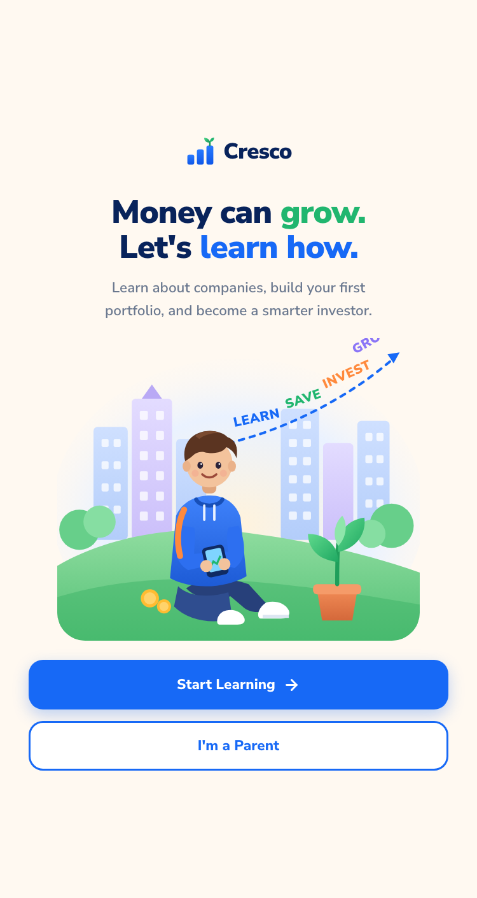
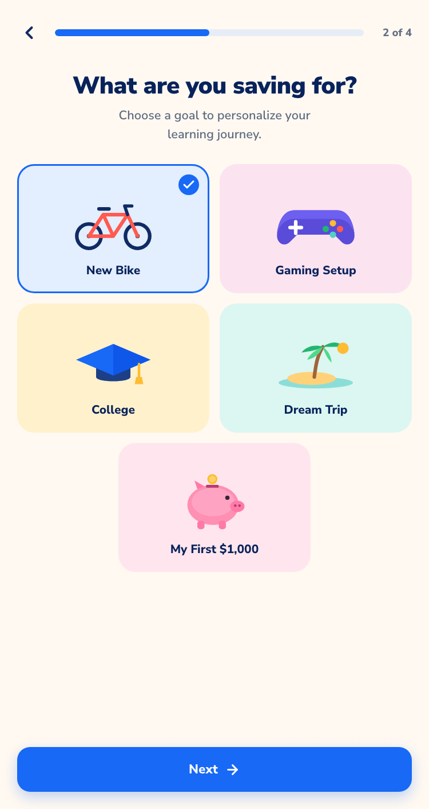
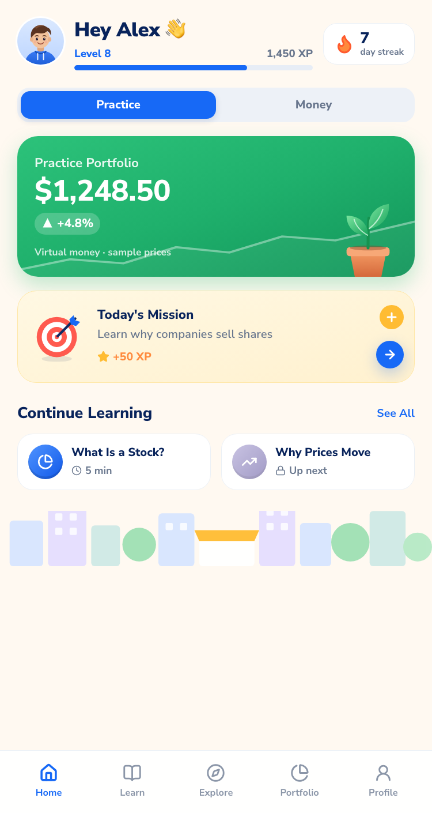
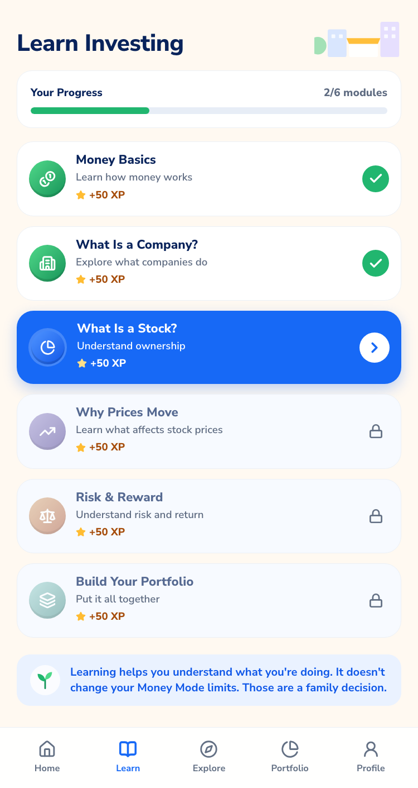
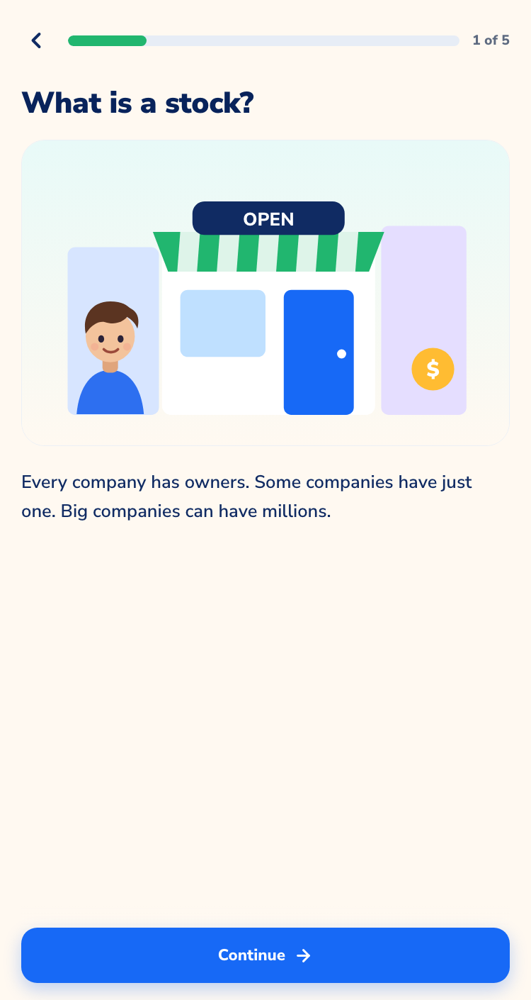
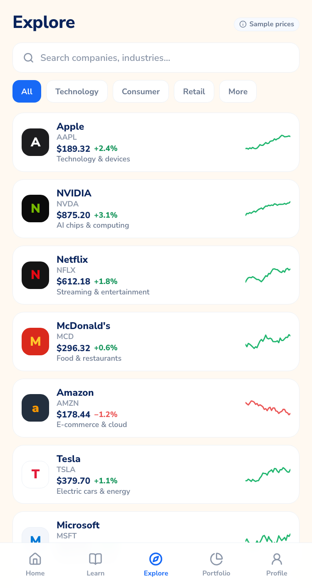
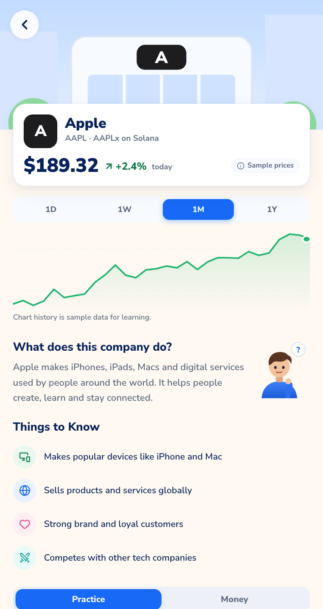
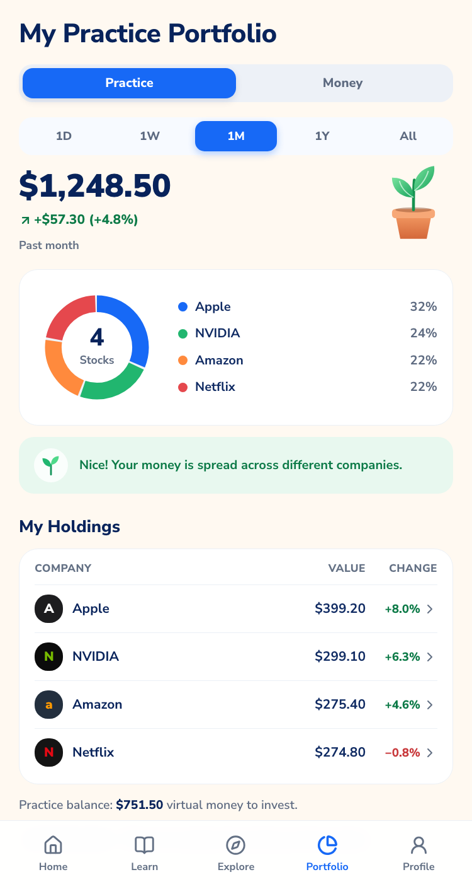
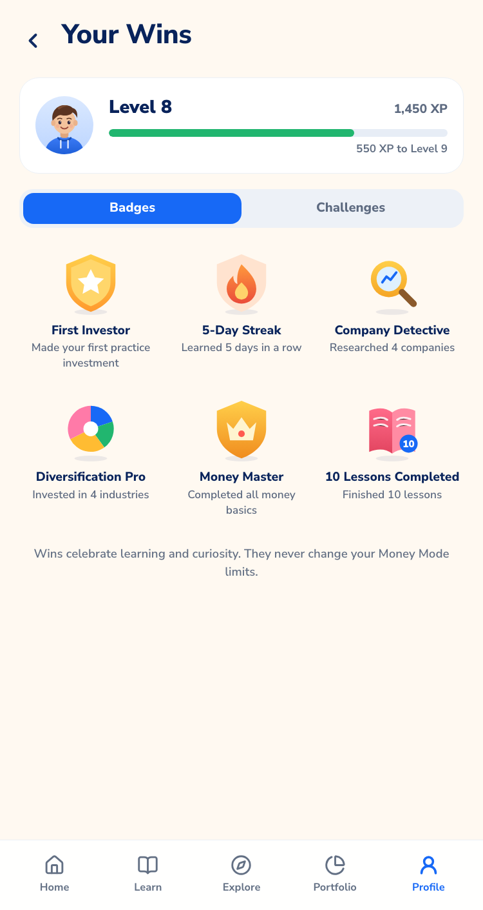
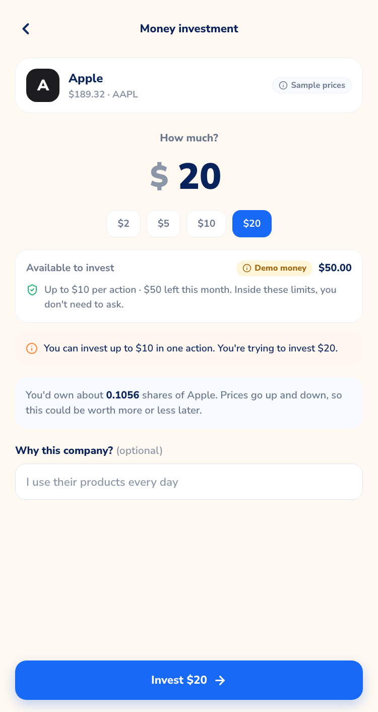

# Cresco — Frontend Implementation Summary

Branch: `feat/cresco-consumer-frontend` · Workspace: `apps/web` · Date: 2026-09-24

The Cresco consumer frontend is a mobile-first responsive web app built from the approved 10-screen mockup and `CRESCO-FRONTEND-DESIGN-SPEC.md`. It lives in an isolated workspace so the root KEYS backend package, Anchor program, Pyth adapter and CI are untouched.

Related docs:
- [CRESCO-FRONTEND-DESIGN-SYSTEM.md](CRESCO-FRONTEND-DESIGN-SYSTEM.md) — tokens, components, mode semantics, responsive, motion, a11y
- [CRESCO-BACKEND-INTEGRATION-HANDOFF.md](CRESCO-BACKEND-INTEGRATION-HANDOFF.md) — current integration surface + remaining production gaps
- [CRESCO-BACKEND-DELTA-2026-09-24.md](CRESCO-BACKEND-DELTA-2026-09-24.md) — corrections to the older backend snapshot

---

## 1. Workspace decision

The repo had no frontend workspace (only the legacy static `demo/` page) and a single `main` branch with no open frontend work. I created `apps/web/` as a standalone Next.js package:

- no changes to root `package.json`, `Anchor.toml`, `programs/`, `src/`, `api/`, `vercel.json` or existing workflows;
- own `package.json` and lockfile; not an npm workspace, so root `npm install` / `npm test` behave exactly as before;
- deploy as a separate Vercel project with root directory `apps/web`;
- new CI workflow `.github/workflows/web.yml` (path-filtered) runs typecheck, lint, tests and build.

Stack: Next.js 16 (App Router, Turbopack), React 19, TypeScript, Tailwind CSS v4, `lucide-react` icons, Nunito Sans. Charts and illustrations are hand-written SVG (no chart or illustration dependency). Tests: Vitest + Testing Library.

---

## 2. Routes and screens

| Mockup | Route | Notes |
|---|---|---|
| 1 Welcome | `/` | Cresco wordmark replaces Stockplaner. Desktop adds the board headline + Learn/Play/Invest/Grow pillars |
| – Child entry | `/start` | Email or demo; no wallet step |
| 2 Personalization | `/onboarding/goal` (step 2 of 4) | Steps: about → goal → interests → ready |
| 3 Home | `/home` | Greeting, Level/XP, streak, mode switch, Practice/Money hero, mission, continue learning |
| 4 Learn | `/learn` | 6 modules, sequential unlock, complete/current/locked |
| 5 Lesson | `/lesson/[id]` | Data-driven player; concept + quiz steps; gentle retry; completion celebration |
| 6 Explore | `/explore` | Search, All/Technology/Consumer/Retail/More, 10 real-universe companies with sparklines |
| 7 Company Detail | `/explore/[ticker]` | Identity, `AAPLx on Solana` as secondary, 1D–1Y chart, about, things to know, mode-aware CTAs |
| 8 Portfolio | `/portfolio` | Practice/Money, period selector, donut, insight, holdings |
| 9 Your Wins | `/profile/wins` | Level card, Badges / Challenges |
| 10 Parent | `/parent` | Stats, Money balance + Add money, request queue, current limits (adjust/pause), performance, topics, weekly bars, controls |
| – Invest | `/invest/[ticker]?mode=&amount=` | Practice buy; Money ALLOW / boundary / ask for more room / allow-once |
| – Profile | `/profile`, `/profile/limits`, `/profile/parent`, `/profile/about` | My limits (child view of the Mandate), parent link, how Cresco works + technical details + demo controls |
| – Parent | `/parent/sign-in`, `/parent/limits`, `/parent/requests/[id]`, `/parent/add-money`, `/parent/settings` | Guardian authority lives only here |
| – | `not-found`, `manifest.webmanifest`, `icon.svg` | PWA manifest + icon |

---

## 3. Bounded autonomy, as built

Verified end to end in the browser:

1. Alex (Money, limit $10/action, $50/month) invests **$5 in Apple** → **ALLOW immediately**, no approval step. Success screen: "allowed with no parent approval needed… no transaction was sent."
2. Alex tries **$20** → *This is outside your current limit. You can invest up to $10 in one action. You're trying to invest $20.* → Ask for more room / Adjust amount / Practice instead.
3. Alex sends a one-line reason → Home shows "Waiting for your parent".
4. Parent opens the request → **Widen limits** → before/after diff ($10 → $20) → confirm → Mandate **v5 / nonce 4**, which matches the backend fixture's `human_widen` beat.
5. The same $20 action now **ALLOWs**.

Also implemented: **Allow once** (single use, same asset, amount ≤ requested, same nonce; consumed on use), **Not this time** with optional note, **Pause/Resume** (Money refuses with "Money Mode is paused"), assets outside the Mandate (TSLA → "Practice this instead"), assets unavailable in Money Mode (META → disabled CTA), insufficient balance, and fail-closed on backend errors.

Learning, XP, badges and P&L never touch the Mandate. This is covered by tests.

---

## 4. Data, mocks and real integrations

**Mocked (centralized in `src/mocks/`):**
- `market.ts` — the only sample prices. 10 assets, all real intended xStocks mappings (AAPL/AAPLx, NVDA/NVDAx, TSLA/TSLAx, NFLX/NFLXx, AMZN/AMZNx, MSFT/MSFTx, META/METAx, MCD/MCDx, SPY/SPYx, QQQ/QQQx). All `dataStatus:"mock"`, `priceSource:"mock"`. Deterministic sample series end at the sample price.
- `family.ts` — demo family (Alex, parent Sam), Mandate v4/nonce 3, $50 demo balance, practice holdings sized to reproduce the mockup ($1,248.50, +$57.30, +4.8%), badges, challenges, sample weekly minutes.
- `learning.ts` — lesson content (original copy, not mock data).

**Real integrations (optional, `NEXT_PUBLIC_KEYS_API_URL`):**
- `POST /api/v0.2/actions/evaluate` — frozen Money decision route.
- `GET /api/v0.1/demo/live-proof` — overlays a live Pyth TSLA price only when evidence is FRESH.
- `GET /api/v0.2/demo/runtime` — implemented stable TSLA devnet proof-lane metadata.
- `POST /api/v0.2/actions/execute` — implemented real Solana devnet demo-token execution bridge; dedicated stable-runtime smoke proof is the current proof gate.
- `GET /api/v0.2/integrations/prestocks` and `/:symbol` — optional PreStocks representation/Practice context.

**Still not production-integrated:** funding, production auth/family link, persistent guardian request decisions/allow-once, production wallet/custody architecture, and persistence of learning/portfolio. See the handoff and backend delta docs.

---

## 5. States

Every data-driven section has loading (dimension-matched skeletons), success, empty, error and unavailable states; offline banner; not-found page. They can all be triggered from **Profile → How Cresco works → Demo controls**: parent connected, market data fails, slow network, empty practice portfolio, reset demo.

---

## 6. Test results (final run)

| Check | Command | Result |
|---|---|---|
| Typecheck | `npm run typecheck` (apps/web) | ✅ pass |
| Lint | `npm run lint` (apps/web) | ✅ pass, 0 warnings |
| Unit/component tests | `npm test` (apps/web) | ✅ 38/38 across 6 files |
| Production build | `npm run build` (apps/web) | ✅ 52 static pages + 2 dynamic routes |
| Root backend tests | `npm test` (repo root) | ✅ 56/56, unchanged |

Notable tests:
- `domain/policy.test.ts` — 9 parity cases run through both the frontend preview and the backend's `src/bounded-autonomy.mjs` (same decision, reason code, request availability).
- `mocks/mocks.test.ts` — asset universe is exactly the intended 10 xStocks mappings, no concept-art companies, every mock price marked mock, mockup numbers reproduced.
- `services/services.test.ts` — in-bounds ALLOW needs no guardian; over-limit → boundary; paused/unavailable/balance refusals; allow-once scope and nonce binding; widen advances version+nonce; allow-once/refuse leave authority unchanged.
- `state/store.test.ts` — learning completion never changes the Mandate; practice and money state stay separate.
- `components/components.test.tsx` — boundary copy and request availability, mode switch + Money explainer, mock prices never labeled live.

---

## 7. Visual QA

Compared against the mockup at 375px in the in-app browser; fixed drift in grouped passes:
- Company Detail: the sticky CTA block covered content (mockup has inline CTAs) → made it inline; moved the price-source tag off the identity line.
- Learn: header illustration overlapped the title → inline beside it; tightened row density toward the mockup.
- Parent dashboard: horizontal overflow at 375px from an implicit grid track → explicit single column + `min-w-0`; restructured the balance card so labels don't wrap.
- Tablet rail showed both the mark and the full wordmark → fixed the class conflict.
- Desktop Home: XP bar stretched full width → constrained to the main column.
- Onboarding on desktop: CTAs floated far below content → kept close from `md` up.

Checked at 375 (mobile), 768 (tablet) and 1440 (desktop). No horizontal overflow; no console errors observed on the checked routes.

Screenshots (500px-wide phone layout, production build): [`docs/cresco-screens/`](cresco-screens/)

| | | |
|---|---|---|
|  |  |  |
|  |  |  |
|  |  |  |
|  | | |

---

## 7b. Hackathon Quality pass (fixes)

| ID | Sev | Issue | Fix | Regression |
|---|---|---|---|---|
| Q001 | P1 | `typecheck` failed on a clean checkout (route types only exist after `next dev/build`), so the new CI workflow would fail | `typecheck` = `next typegen && tsc --noEmit` | Fresh clone + `npm ci` + full check |
| Q002 | P2 | 11 text/background pairs failed WCAG AA (muted 2.9:1, XP orange 2.2:1, gains 3.9:1, loss 3.5:1, white on green 2.8:1) | Text-safe tokens; deeper Practice green | Contrast recomputed |
| Q003 | P1 | Rapid repeat clicks executed a Money buy 3× and could overspend the period limit; same for requests, decisions, add money, limits | `useSingleFlight` synchronous guard on every side-effecting handler | Browser triple-click → 1 effect; unit test |
| Q004 | P2 | Allow-once success said "no parent approval needed" (false); in-bounds buys also consumed a pending allowance | Truthful allow-once copy; allowance used only when the standing Mandate would refuse | Browser |
| Q005 | P3 | Period-limit request sheet labeled remaining monthly room as "Your current limit" | "Left this month" | Browser |
| Q006 | P2 | Requests made under an older Mandate stayed "pending" forever | `isRequestStale`; shows "Limits changed", excluded from parent queue | Unit test + browser |
| Q008 | P2 | Malformed persisted state crashed the app on every load | `restoreState` validation + `app/error.tsx` with reset | Unit test + browser |
| Q009 | P3 | Negative/huge URL amounts prefilled the input | Sanitized in the route | Browser |
| Q010 | P2 | Practice over-balance showed Money copy ("ask your parent to add money") | Mode-aware copy | Unit test + browser |
| Q011 | P3 | Sheet initial focus used rAF (paused in background tabs) | Focus synchronously | Component test |

Known gap (accepted, P1): parent/child separation is demo-only. Anyone on the device can open the parent view. Real separation needs backend auth (handoff §3.7); the on-chain program already requires the guardian signature for widening.

## 7c. Deployment

Live: **https://cresco-lac.vercel.app** — a standalone Vercel project (`cresco`) deployed from `apps/web` only. It does not touch the KEYS backend, its `vercel.json`, or any existing Vercel project. No environment variables are set, so it runs in demo mode (local policy preview, sample prices).

Verified on the deployment: all primary routes return 200 (unknown routes 404); full Critical Demo Path ($5 ALLOW with double-click → 1 effect, $20 boundary → request → parent widen to v5/nonce 4 → $20 ALLOW); no console errors.

## 8. Known limitations

- Illustrations are original hand-built SVG in the mockup's spirit. They're simpler than the mockup's rendered 3D art; a raster illustration pass would get closer.
- Company identities use brand-colored lettermarks, not trademarked logos. The Company Detail hero is an illustrated storefront, not the mockup's photo.
- All state is per-device (localStorage). No accounts, no sync between the child and parent devices. Both views share one browser in the demo.
- The deployed Cresco site remains demo-first until a KEYS backend URL and runtime env are connected. The repo now contains an implemented TSLA devnet execution proof lane, but it remains explicitly demo-token / server-held-demo-signer infrastructure rather than brokerage, custody or real securities execution.
- Only TSLA can ever show a live price, and only with a configured backend Pyth key. Series/history are always sample data.
- Headless screenshots are 500px wide because headless Chrome enforces a minimum window width; the in-browser QA used 375px.
- The parent "Last 30 days" control is a static label; the weekly bars are a labeled sample week.

---

## 9. Run it

```bash
cd apps/web
npm install
npm run dev            # http://localhost:3000
npm run check          # typecheck + lint + test + build

# optional: real KEYS decisions
(cd ../.. && npm install && npm run api)
echo "NEXT_PUBLIC_KEYS_API_URL=http://127.0.0.1:8787" > .env.local
```

Demo path: `/` → Start Learning → *Try the demo as Alex* → Home → Explore → Apple → Money → Invest $5 → back → invest $20 → Ask for more room → Profile → Parent view → Continue as Sam → Review → Widen → back to Alex → invest $20 again.
